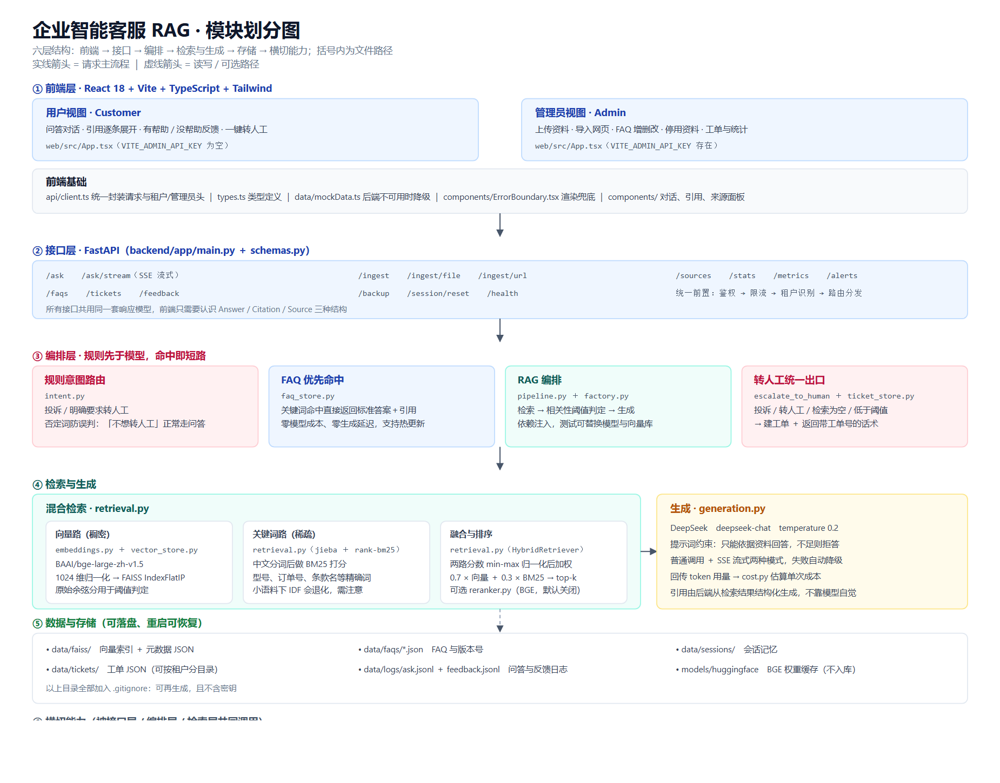
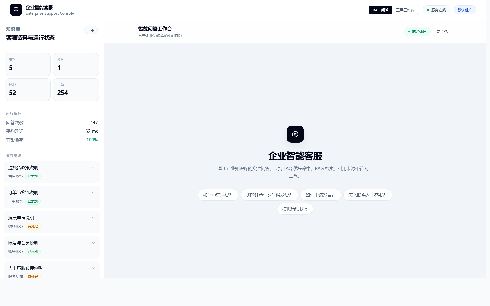
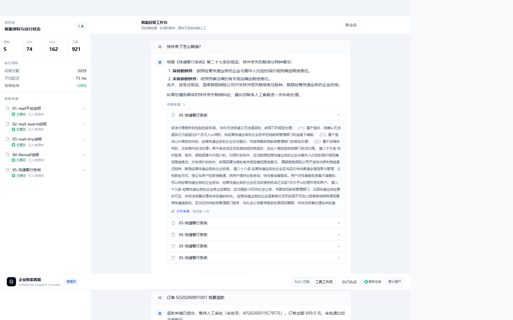
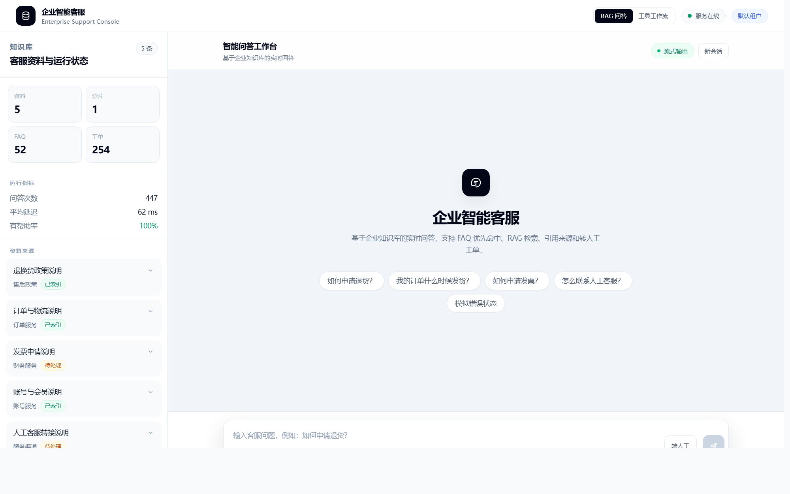

# 企业智能客服 RAG / ServiceOps Agent

企业知识库问答 + 可选工具调用工作流：FAQ 优先命中、混合检索、DeepSeek 生成、引用溯源、转人工工单，并带执行轨迹与可复现评测。

## 定位

这是一个**生产级应用工程**项目，不是算法研究项目。核心目标是把 LLM 能力做成可评测、可追踪、可降级的业务系统：

- 默认 `workflow_mode="rag"`：保持原有 RAG 问答（混合检索 + 生成 + 引用）。
- 可选 `workflow_mode="tools"`：意图路由 → 工具调用 → 质量判断 → 回答或转人工。

## 架构



六层结构：前端 → 接口 → 编排 → 检索与生成 → 存储 → 横切能力。矢量版 `docs/architecture-modules.svg`，文字版 `docs/architecture-modules.md`。

## 界面

管理员控制台（来源管理、统计、Trace 入口）：



执行轨迹（意图 → 工具 → 结果，含重试、耗时、token 与成本）：



用户视图（只保留问答与转人工）：



## 核心能力

| 能力 | 说明 |
| --- | --- |
| 混合检索 | BAAI/bge-large-zh-v1.5 + FAISS（IndexFlatIP）+ jieba + rank-bm25，min-max 融合（0.7 / 0.3） |
| 父子切分 | `HIERARCHICAL_CHUNKING=true` 时子块检索、父块生成，长文档上下文更完整 |
| FAQ 优先 | 命中标准问题直接返回，零模型成本；支持运行时增删改 |
| 规则意图 | 投诉、明确转人工、否定词防误判 |
| 工具工作流（可选） | `knowledge_search` / `order_lookup` / `logistics_track` / `human_handoff`，含 schema 校验、错误码、超时与重试 |
| 输入护栏 | 提示词注入、密钥探测、跨租户尝试直接转人工并记录原因 |
| 相关性阈值 | `RAG_MIN_SCORE` 用原始余弦相似度判断"资料不足"，避免硬答 |
| 转人工闭环 | 投诉 / 明确要求 / 资料不足 / 工具连续失败 → 建单 + 带工单号话术 |
| 副作用审批 | 高风险写操作（退款）默认只出 dry-run 预览并生成审批单，管理员批准后才执行；审批幂等、按租户隔离 |
| 执行轨迹 | `trace_id` + 按天 JSONL + `GET /traces/{trace_id}`，写入前脱敏手机号 / 邮箱 / 证件号 / Key |
| 多租户 | `X-Tenant-ID` 贯穿资料、FAQ、会话、工单、检索与轨迹 |
| 可观测 | JSONL 日志、`/metrics`、`/alerts`、可选 Webhook |

## 快速开始

### 一条命令（推荐）

双击项目根目录的 `start-all.bat`，会开三个窗口：

| 服务 | 地址 |
| --- | --- |
| 后端接口文档 | http://127.0.0.1:8000/docs |
| 管理员前端 | http://127.0.0.1:5173/ |
| 用户前端 | http://127.0.0.1:5174/ |

### 手动启动

```bash
# 后端
cd backend
..\.venv\Scripts\python.exe -m uvicorn app.main:app --host 127.0.0.1 --port 8000

# 前端（管理端）
cd web
npm run dev

# 前端（用户端，管理入口关闭）
npm run dev -- --mode user --port 5174
```

环境变量示例见 `backend/.env.example`，真实 Key 只放在未被跟踪的 `backend/.env`。

### Docker Compose（配置已就绪，尚未实机验证）

```bash
docker compose up --build
```

后端在 8000、前端在 5173；`web` 会等 `backend` 健康检查通过再启动。模型权重与数据目录通过 bind mount 挂载。完整步骤、验证清单、回滚与故障排查见 `docs/DEPLOYMENT.md`。

## 评测

### RAG 检索评测（真实 BGE，50 条）

```bash
cd backend
..\.venv\Scripts\python.exe -m evaluation.enterprise_eval --offline
```

命令行默认走真实嵌入模型（`--embedder bge`），`--embedder hash` 只用于快速回归；`--offline` 表示模型已缓存、跳过联网校验（150 秒 → 17 秒）。实测：hit@1 = 0.96、hit@3 = 1.00、hit@5 = 1.00、MRR = 0.98。

### Agent 任务评测（150 条，零 API 花费）

```bash
cd backend
..\.venv\Scripts\python.exe -m evaluation.agent_eval --tag full --use-real-embedder --offline
```

约 18 秒跑完，默认用确定性生成器，因此测的是路由、工具、参数、转人工与降级这些不依赖生成质量的指标。评测集 = 100 条新增 Agent 任务（订单 25 / 物流 15 / 政策 15 / 多轮 20 / 投诉转人工 13 / 拒答与注入 12）+ 50 条知识问答。

| 指标 | 实测 |
| --- | --- |
| 任务成功率 | 99.33% |
| 路由 / 工具选择准确率 | 100.00% |
| 工具参数准确率 | 100.00% |
| 引用准确率 | 87.32% |
| 违规 / 幻觉率 | 0.00% |
| 转人工 Precision / Recall | 96.43% / 100.00% |
| 自动解决率 | 99.19% |
| P50 / P95 延迟 | 1 ms / 102 ms |

报告留档在 `backend/evaluation/reports/`。分档：`--tag smoke|core|full`（25 / 60 / 150 条），日常跑冒烟、里程碑跑全量。

### 单元与集成测试

```bash
cd backend && ..\.venv\Scripts\python.exe -m pytest -p no:cacheprovider -q   # 103 passed
cd web && npm test && npm run typecheck && npm run build                     # 22 passed
```

## 关键设计决策

1. **Agent 工作流做成可选模式**，默认 `rag`：新增能力不影响既有链路，出问题一个参数回退。
2. **规则先于模型**：投诉、明确转人工、输入护栏在规则层短路，不进检索与生成。
3. **阈值看原始余弦相似度**：归一化分数永远有最大值 1.0，做不了绝对判断；0.42 挡下 8/8 无关问题、保留 49/50 相关问题。
4. **评测分两套**：检索质量用真实 BGE 单独评测；Agent 任务指标不依赖生成质量，因此可以零成本高频回归。

## 已知边界

- **部署前必做**：默认不强制鉴权（未配置 `ADMIN_API_KEY` / `OIDC_JWKS_URL` 时启动会打印警告），公网部署前必须配置鉴权或前置网关；前端镜像已通过 `web/.dockerignore` 排除 `.env`，避免管理员 Key 被内联进 JS 产物。
- 业务数据为**本地模拟**（`backend/mock/orders.json`，20 订单 + 10 物流），未接入真实订单 / CRM / 退款系统。
- 工具为只读 + 本地建单，未实现真实副作用操作，因此也没有审批流。
- 阈值 0.42 是在 10 条示例语料上校准的，换真实资料必须重新采样。
- 知识类问题严格文案命中率 60%，因为答案是 FAQ 措辞而非语料原文；该项只作参考。
- 未实现多轮工具组合、parent-child 检索、知识版本热更新、独立监控平台。

## 目录结构

```text
backend/app/             FastAPI 接口、检索、生成、工具、工作流、轨迹、工单、会话、租户
backend/mock/            本地模拟订单与物流数据
backend/evaluation/      检索评测、Agent 评测、评测报告
backend/tests/           103 个 pytest 用例
web/src/                 React 前端（管理端 / 用户端、Trace 面板）
docs/                    架构图、阶段方案、案例与失败复盘
start-*.bat              一键启动脚本
```

## 文档

- `PROGRESS.md`：当前进度与实测数字
- `HANDOFF.md`：交接文档（目标、文件地图、决策、约束）
- `INTERVIEW.md`：面试材料（陈述、问答、数字口径）
- `docs/PHASE0-最小改动方案.md`：本阶段改造方案
- `docs/CASE-STUDY.md`：一页项目案例
- `docs/FAILURE-CASES.md`：真实故障与排查记录
- `docs/DEPLOYMENT.md`：Docker 部署、验证清单、回滚与故障排查
