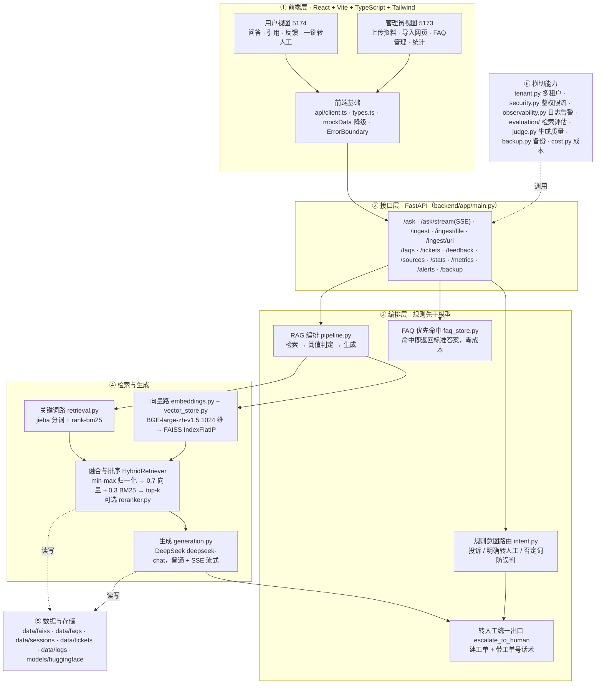

# 模块划分图

六层结构：**前端 → 接口 → 编排 → 检索与生成 → 存储 → 横切能力**。核心原则是「规则先于模型，命中即短路」：能在规则层解决的问题不进入检索，能在检索层解决的问题不进入生成。

图片版本：

- `docs/architecture-modules.svg`（矢量，推荐，可无限放大）
- `docs/architecture-modules.png`（位图，1480 × 1160，方便直接插入 PPT / 文档）

## 结构图

## 各层职责与关键文件

| 层 | 关键文件 | 职责 |
| --- | --- | --- |
| ① 前端 | `web/src/App.tsx`、`web/src/api/client.ts`、`web/src/components/` | 用户视图与管理视图共用一套组件，用 `VITE_ADMIN_API_KEY` 是否为空来区分；后端不可用时自动降级到示例数据 |
| ② 接口 | `backend/app/main.py`、`backend/app/schemas.py` | 20 个 REST 接口、SSE 流式、鉴权、限流、租户识别 |
| ③ 编排 | `intent.py`、`faq_store.py`、`pipeline.py`、`factory.py`、`ticket_store.py` | 规则意图 → FAQ 优先 → RAG → 转人工，四段式；`factory.py` 负责依赖注入 |
| ④ 检索 | `chunking.py`、`embeddings.py`、`vector_store.py`、`retrieval.py`、`reranker.py` | 切分、BGE 向量、FAISS、jieba + BM25、融合排序、可选重排 |
| ④ 生成 | `generation.py` | DeepSeek 调用（普通 / 流式）、提示词约束、token 用量回传 |
| ⑤ 存储 | `backend/data/`、`models/` | 索引、元数据、FAQ、会话、工单、日志、模型权重；全部 gitignore |
| ⑥ 横切 | `tenant.py`、`security.py`、`observability.py`、`evaluation/`、`judge.py`、`backup.py`、`cost.py` | 多租户、鉴权限流、可观测性、评估、备份、成本 |

## 两条主数据流

**导入**：文件 / 网页 → `ingestion.py` 清洗 → `chunking.py` 切分 → `embeddings.py` 编码 → `vector_store.py` 写 FAISS + 元数据、同时写 BM25 索引。

**问答**：提问 → 规则意图（命中即转人工并建单）→ FAQ 关键词命中（命中即返回）→ 混合检索 → 相似度阈值判定（不达标则拒绝并转人工）→ DeepSeek 生成 → 返回答案 + 结构化引用 → 写日志与指标。
